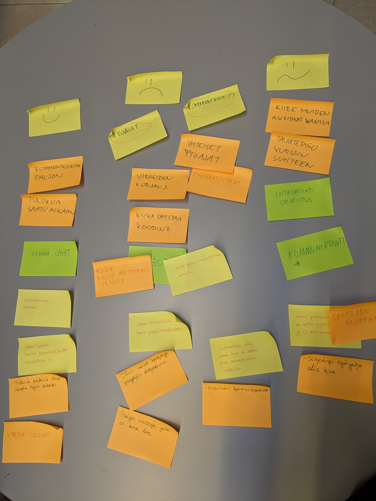

## Sprintti 2 - Retrospektiivi

### Kehityskohteet

Retrospektiivissa havaittiin seuraavat kehityskohteet:
1. Yhteisten työskentelyaikojen selkiyttäminen: kaikkilla on hieman erilaiset aikataulut ja mieltymykset työskennellä. Yhteiset toimintatavat ja periaatteet kaipaavat vielä selkiyttämistä.

2. Kommunikoinnin ja kommuniointikanavien selkiyttäminen: aluksi kommunikointikanavksi valittu Telegram toimii hieman huonosti, koska kaikki eivät pysty ja ehdi seuraamaan kanavaa samalla tavalla. Ja jos viestejä tulee paljon, hukkuu osa viesteistä viestitulvaan. Lisäksi TG sopii huonosti etätyöskentelyyn.

### Kehitystoimenpiteet

#### 1.
Tavoitteena on, että pyritään työskentelmään ainakin osa ajasta suunnilleen samaan aikaan. Työskentely voi tapahtua joko kasvotusten tai etenä. Lisäksi selkeästi määriteltyjä tehtäviä voi jokainen tehdä silloin kun parhaiten sopii. 

Sovittiin että seuraavassa sprinteissä yhteiset työskentelyajat ovat tiistaisin heti demon jälkeen ja perjantaisin Kumpulan kampuksella. Tiistaisin tapaamme kasvotusten ja perjantaisin voi tulla joko kampukselle tai liittyä mukaan etänä.       Lisäksi maanantaisin pyritään olemaan tavoitettavissa, jotta saadaan viimeisteltyä sprintin vaativat tehtävät tiistain asiakastilaisuutta varten.

#### 2.
Koska kaikilla on Telegram asennttuna puhelimeen, soviittin että kakki akuutti ja ei itse projektin tehtäviin iiittyvä kommunikointi tapahatuu siellä. Sen sijaan projektien tehtäviin liittyvä ja ei akuutti keskustelu (miten jokin asia tehdään, ongelmatilanteet yms) käydään jatkossa Discrodissa. Discrodia hyödynnetään myös etätyöskentelyssä.

Lisäksi sovittiin, että jos joku tekee itsenäisesti jotain tehtäviä, niin hän ilmoittaa muille esim Discrodisa mitä on tehnyt, ja päivittää tiedon myös sprintti-backlogiin.   

